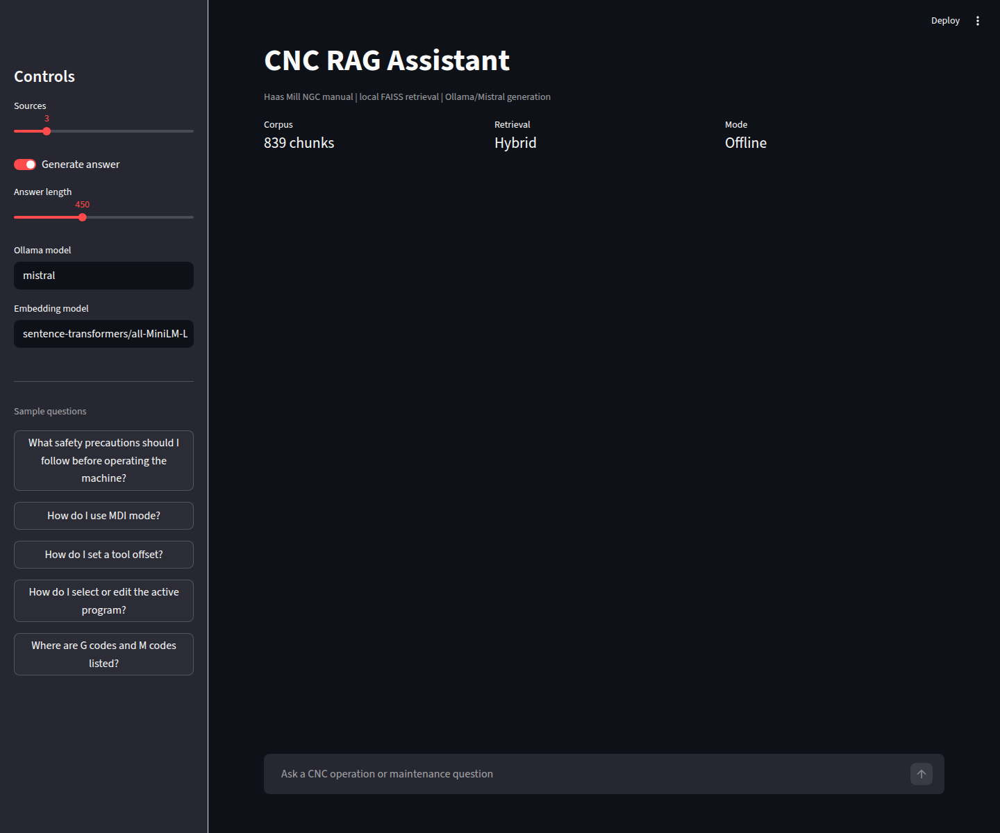
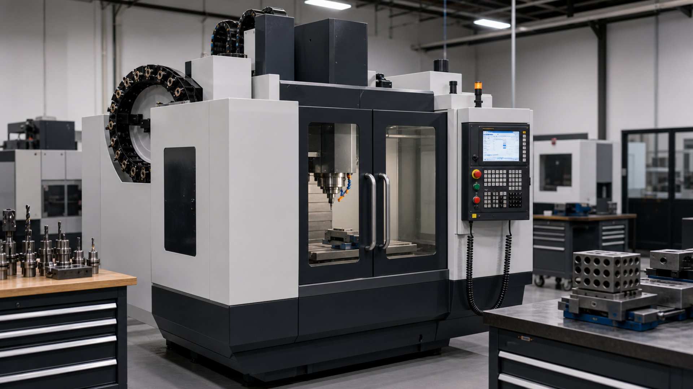
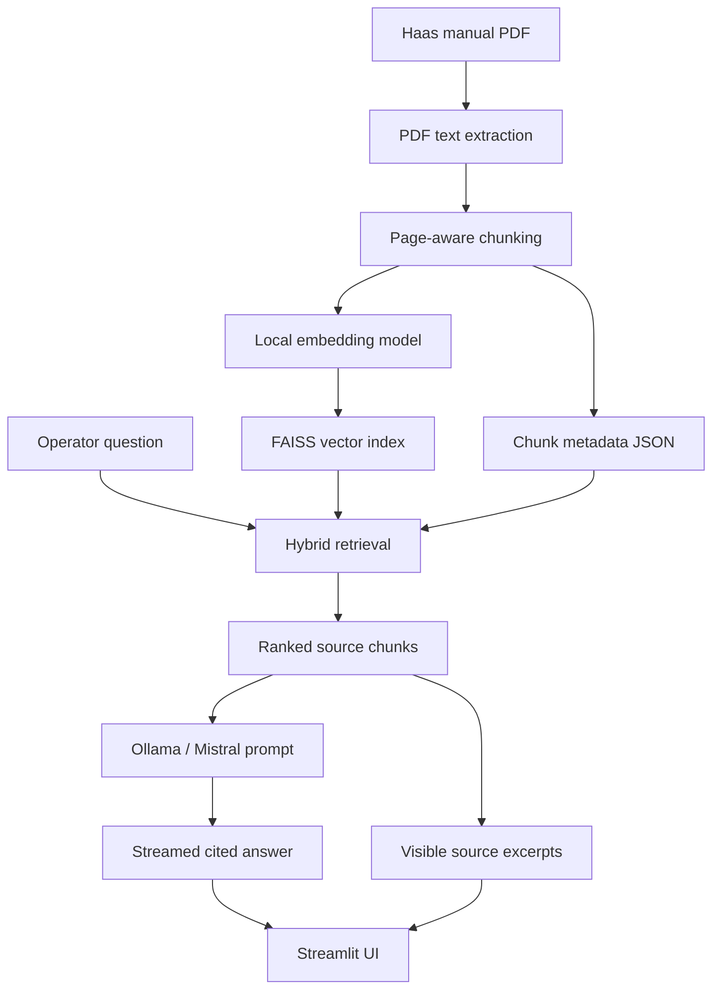

# Offline CNC RAG Assistant


An offline Retrieval-Augmented Generation assistant for CNC machine operation and maintenance documentation.


This project demonstrates how a local AI assistant can help operators and technicians search dense industrial manuals, retrieve relevant technical evidence, and generate cited answers without depending on a cloud LLM.

The prototype targets a Haas CNC Mill with Next Generation Control using publicly available Haas operator documentation.



## Why This Project

Manufacturing environments depend on fast decisions. When a machine operator has a question about setup, offsets, alarms, safety, program editing, or maintenance checks, the answer is often somewhere in a manual, procedure, or training resource. The challenge is that finding the right page at the right moment can interrupt production flow.

In many shops, this creates unnecessary back-and-forth:

```text
Operator has a question
  -> asks a more experienced operator
  -> waits for a supervisor or manager
  -> searches a manual or shared folder
  -> returns to the machine
  -> repeats if the answer was incomplete
```

That loop is normal in industrial work, but not every question needs escalation. Many questions are documentation questions: where a feature is described, what a control key does, what a procedure says, or which manual page explains a setting. A local assistant can reduce that friction by giving operators a first place to ask grounded questions while still pointing back to the official source.

The intended role of this assistant is:

- help operators learn machine functions more independently,
- reduce repeated interruptions for managers and senior operators,
- support maintenance technicians during troubleshooting,
- keep answers tied to official machine documentation,
- escalate only when the manual is insufficient, the answer is uncertain, or the action has safety implications.

This is especially relevant for industrial engineering and manufacturing settings where productivity, safety, standard work, and knowledge transfer all matter at the same time.

## Why CNC Specifically

CNC machines are a strong use case for offline RAG because they sit at the intersection of mechanical systems, controls, programming, tooling, workholding, maintenance, and operator safety.



A CNC operator may need to understand:

- operating modes such as MDI, MEM, EDIT, and HANDLE JOG,
- offsets, tool lengths, work coordinates, and probing routines,
- G-code and M-code references,
- alarm or warning behavior,
- setup procedures,
- coolant, lubrication, and maintenance checks,
- safety rules and machine-specific cautions.

The documentation is technical, dense, and highly procedural. It is also exactly the kind of information that should not be guessed by a generic chatbot. A RAG system is a good fit because it can retrieve the relevant manual pages first, then generate an answer from those sources.

CNC also makes the portfolio story concrete. Instead of building a generic "chat with PDF" application, this project focuses on a real manufacturing workflow where retrieval quality, citations, latency, and safety boundaries matter.

## Project Motivation

CNC machines are supported by large technical document sets: operator manuals, alarm references, setup procedures, maintenance guides, and training material. These resources are accurate, but they are often difficult to search quickly during production or troubleshooting.

This project explores a practical offline alternative:

- ingest machine documentation,
- index it locally,
- retrieve relevant manual sections,
- generate grounded answers with source citations,
- and keep the system usable in low-connectivity industrial environments.

The goal is not to replace trained operators, supervisors, or maintenance personnel. The goal is to provide fast, traceable access to machine documentation so routine questions can be answered quickly and higher-risk questions can be escalated with better context.

## Tech Stack

| Layer | Technology | Role |
| --- | --- | --- |
| Language | Python | Core ingestion, retrieval, generation, CLI, and UI logic |
| PDF processing | `pypdf` | Extract text from machine manuals |
| Embeddings | `sentence-transformers/all-MiniLM-L6-v2` | Convert manual chunks and questions into vectors |
| Vector search | FAISS | Local similarity search over embedded chunks |
| Retrieval scoring | Custom hybrid scoring | Combines semantic, keyword, and procedural signals |
| Local LLM runtime | Ollama | Runs the model locally without a cloud API |
| LLM | Mistral | Generates answers from retrieved documentation |
| UI | Streamlit | Local browser interface for chat and source review |
| Evaluation | Pytest + custom eval set | Checks retrieval quality against expected pages and terms |

## Acronyms And Terms

| Term | Meaning | In This Project |
| --- | --- | --- |
| CNC | Computer Numerical Control | The machine type supported by the assistant; a CNC mill is used as the demo machine. |
| RAG | Retrieval-Augmented Generation | The architecture that retrieves manual excerpts before generating an answer. |
| LLM | Large Language Model | The local model that writes the final answer from retrieved sources. |
| FAISS | Facebook AI Similarity Search | The local vector index used for fast similarity search. |
| PDF | Portable Document Format | The source format for the Haas operator manual. |
| UI | User Interface | The Streamlit chat interface used to ask questions and inspect sources. |
| CLI | Command-Line Interface | Terminal commands such as `cnc-rag ingest`, `cnc-rag search`, and `cnc-rag eval`. |
| MDI | Manual Data Input | A CNC control mode where unsaved blocks of code can be entered and run. |
| G-code | Geometric code | CNC programming instructions that define machine motion and operations. |
| M-code | Miscellaneous code | CNC programming instructions for machine functions such as coolant or spindle control. |
| NGC | Next Generation Control | The Haas control family referenced by the selected operator manual. |
| OCR | Optical Character Recognition | A possible future feature for extracting text from scanned manuals or images. |
| SOP | Standard Operating Procedure | A future document type that could be ingested alongside manuals and maintenance guides. |

## Demo Machine And Corpus

The current demo corpus is based on a Haas CNC mill because Haas publishes realistic operator documentation that can be used in a reproducible portfolio project.

Primary source:

- Haas Operator's Manual hub: https://www.haascnc.com/owners/Service/operators-manual.html
- Haas Mill NGC Operator's Manual PDF: https://www.haascnc.com/content/dam/haascnc/en/service/manual/operator/english---mill-ngc---operator%27s-manual---2025.pdf

Current indexed corpus:

```text
Document: Haas Mill NGC Operator's Manual
Chunks:   839
Index:    FAISS
Model:    sentence-transformers/all-MiniLM-L6-v2
LLM:      Ollama + Mistral
Mode:     Local/offline after setup
```

## Architecture



The system uses a deliberately transparent RAG pipeline. Retrieval scores are shown in the interface so the user can see why sources were selected.

## Retrieval Strategy

The retriever does not rely only on vector similarity. It combines three signals:

- `vector`: semantic similarity from FAISS and local embeddings
- `keyword`: query-term coverage in the retrieved chunk
- `procedure`: a small boost for procedural text when the question asks how to perform an action

The final hybrid score is used to rank chunks. Results are also diversified by page so that one page does not crowd out all other useful evidence.

This matters for CNC documentation because many questions are procedural. For example, "How do I set a tool offset?" should prefer step-by-step offset procedures over a generic settings list that merely mentions tool offsets.

## Generation Strategy

Answers are generated locally through Ollama using Mistral.

The model receives only the retrieved manual excerpts and is instructed to:

- answer only from the provided sources,
- cite factual claims using markers such as `[S1]` and `[S2]`,
- avoid unsupported machine-operation instructions,
- say clearly when the sources are insufficient.

The UI streams the answer as it is generated, then applies a citation guard so displayed answer lines end with source markers where possible.

## Interface

The Streamlit UI provides:

- chat-style question answering,
- streamed local generation,
- retrieval status updates,
- retrieval-only fallback,
- cited answers,
- visible source excerpts,
- page numbers,
- hybrid/vector/keyword/procedural scores,
- sample CNC questions in the sidebar.

Run the UI:

```bash
streamlit run src/cnc_rag/ui/app.py --server.fileWatcherType none
```

The `--server.fileWatcherType none` flag avoids unnecessary Streamlit file-watcher scans through large ML libraries.

## Example Questions

The project includes sample questions that represent common operator and maintenance-documentation workflows:

```text
What safety precautions should I follow before operating the machine?
How do I use MDI mode?
How do I set a tool offset?
How do I select or edit the active program?
Where are G codes and M codes listed?
```

Example CLI usage:

```bash
cnc-rag search "How do I set a tool offset?"
cnc-rag ask "How do I use MDI mode?"
cnc-rag chat
```

Example cited answer style:

```text
1. Press [MDI] to enter MDI mode. [S1]
2. In MDI mode, unsaved programs or blocks of code can be entered from the control. [S1]
3. To save an MDI program, move to the beginning, enter a valid program number, press [ALTER], and save it. [S2]

Sources:
[S1] English - Mill Operator's Manual - NGC, page 77
[S2] English - Mill Operator's Manual - NGC, page 223
```

## Evaluation

The project includes a small retrieval evaluation set in `eval/questions.json`.

Run:

```bash
cnc-rag eval --top-k 5
```

Current result:

```text
Cases: 5
Page hit rate@5: 100%
Mean keyword recall@5: 100%
```

Evaluation checks whether retrieved chunks include expected manual pages and expected technical terms. This is intentionally simple, but it makes the project measurable and keeps improvements grounded in retrieval quality rather than chatbot impressions.

## Setup

Create and activate a virtual environment:

```bash
cd cnc-rag-assistant
python3 -m venv .venv
source .venv/bin/activate
pip install -e ".[dev,ui]"
```

Download the demo manual:

```bash
bash scripts/download_sources.sh
```

Build the local index:

```bash
cnc-rag ingest
```

Install and run the local LLM:

```bash
ollama pull mistral
ollama serve
```

Start the UI:

```bash
streamlit run src/cnc_rag/ui/app.py --server.fileWatcherType none
```

## Project Layout

```text
data/
  raw/manuals/        # downloaded PDFs; download separately
  processed/          # extracted chunks; generated locally
  indexes/            # FAISS index and metadata; generated locally
docs/
  project_plan.md
  screenshots/
eval/
  questions.json
scripts/
  download_sources.sh
src/cnc_rag/
  cli.py
  config.py
  evaluation.py
  generation/
  ingestion/
  retrieval/
  ui/
tests/
```

## Manual Upload Support

A manual upload feature is feasible without making the system heavy, but it should be designed carefully.

The current project uses a controlled corpus:

```text
Place PDFs in data/raw/manuals/
Run cnc-rag ingest
Search or ask questions
```

That is the best default for a portfolio MVP because it is reproducible, easy to evaluate, and avoids accidental indexing of unrelated files.

A lightweight upload extension would work like this:

```text
Upload PDF in Streamlit
Save it to data/raw/manuals/
Run the same ingestion pipeline
Rebuild the FAISS index
Show the updated corpus status
```

Recommended guardrails for upload support:

- accept PDF files only,
- show file name and size before indexing,
- require an explicit "Rebuild index" action,
- keep uploaded manuals local,
- display the number of chunks created,
- warn that index rebuilding may take time,
- keep a controlled source registry for portfolio reproducibility.

This extension is useful for a future "admin mode." It is not necessary for the core demo, where a stable corpus makes evaluation and screenshots more reliable.

## Safety Boundary

This project is a documentation assistant, not a machine-control system.

It does not connect to a CNC controller, execute G-code, modify machine state, or replace operator training. It should be treated as a source-grounded help tool that points users back to manufacturer documentation.

Important safety assumptions:

- Operators remain responsible for following site procedures and manufacturer instructions.
- Low-confidence or unsupported answers should be escalated to the manual, supervisor, or qualified maintenance personnel.
- The assistant should not invent procedures, alarm interpretations, or machine settings.
- Source citations are part of the safety design, not a cosmetic feature.

## Limitations

Current limitations:

- The corpus contains one primary manual.
- PDF extraction is text-based and does not fully understand diagrams or schematics.
- Tables may lose some layout fidelity during extraction.
- The retrieval benchmark is small and should be expanded.
- Mistral can still phrase answers imperfectly, even when the retrieved evidence is correct.
- Source citations are prompted and post-processed, not formally verified at sentence level.
- First-run model loading and local generation can be slow on CPU-only machines.

Possible improvements:

- larger evaluation set with expected section titles,
- reranking model for better final ordering,
- table-aware chunking,
- OCR support for scanned manuals,
- diagram/schematic extraction,
- electrical schematic ingestion with component-aware metadata,
- video transcription for manufacturer training videos,
- setup and maintenance procedure ingestion,
- alarm-code-specific retrieval,
- shift handover notes or internal knowledge-base ingestion,
- multilingual manuals and translated answers,
- upload/admin mode,
- multi-manual corpus filtering,
- confidence thresholds,
- FastAPI backend for deployment,
- Docker packaging,
- richer UI screenshots and demo video.

## What This Project Demonstrates

This project demonstrates practical industrial AI engineering:

- local-first RAG architecture,
- vector indexing with FAISS,
- hybrid retrieval beyond simple semantic search,
- local LLM generation through Ollama,
- streamed responses,
- source-grounded answers,
- measurable retrieval evaluation,
- clear safety boundaries for industrial documentation assistance.

The result is a compact but realistic prototype of how RAG can support CNC operation and maintenance workflows without sending sensitive shop-floor documentation to external services.

## Learning Reference: RAG Concepts

This project was informed by modern RAG learning material, including Anthropic's Claude/API course resources. It is not designed as a direct course implementation or Claude-specific clone. Instead, it applies the same general RAG ideas to an offline industrial use case: CNC machine documentation.

RAG concepts that are well covered in this project:

- document ingestion from a real technical manual,
- page-aware text chunking,
- local embeddings,
- FAISS vector indexing,
- semantic search,
- keyword-aware hybrid retrieval,
- procedural scoring for operator-style questions,
- source-grounded generation,
- streamed LLM responses,
- citations and visible source excerpts,
- retrieval evaluation with expected pages and keywords.

Recommended next improvements:

- add BM25 as a formal lexical-search component instead of the current lightweight keyword score,
- add a reranking stage after initial retrieval,
- experiment with contextual retrieval by prepending each chunk with document or section context before embedding,
- add richer evaluation beyond page hit rate, such as answer faithfulness and citation correctness,
- optionally create a hosted-LLM comparison branch, such as a Claude API version, to compare local deployment with managed model quality.

The current project is intentionally offline-first, so it does not depend on Claude or any hosted API. That is a design choice, not a limitation of the RAG architecture. A future hosted-model version would be useful for comparison, but the core value of this project is local, source-grounded industrial assistance.

Relevant Anthropic references:

- Anthropic Academy, "Build with Claude": https://www.anthropic.com/learn/build-with-claude
- Anthropic RAG for Projects help article: https://support.anthropic.com/en/articles/11473015-retrieval-augmented-generation-rag-for-projects
- Anthropic Contextual Retrieval article: https://www.anthropic.com/engineering/contextual-retrieval
- Anthropic search-result citations documentation: https://docs.anthropic.com/en/docs/build-with-claude/search-results
